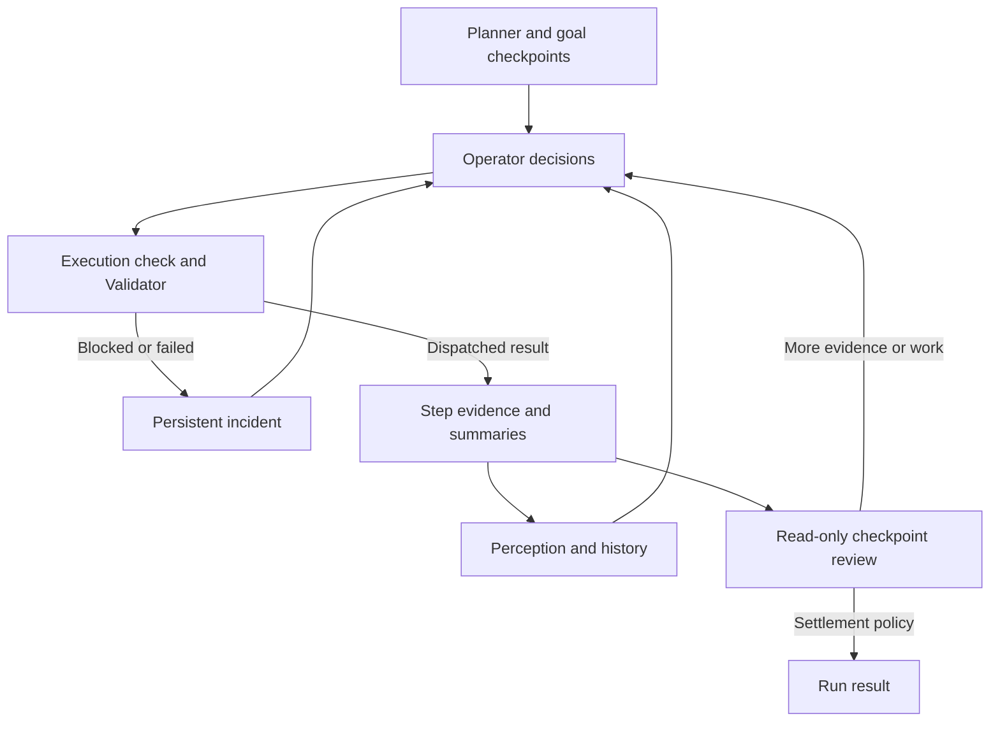

# Artemis infrastructure review and Cyclone upgrade dossier

**Source review: 12 September 2026. Deliverable: 16 individually committed upgrade proposals. Runtime changes: none in this dossier.**

## Main conclusion

Artemis offers useful patterns for recovery context, bounded perception, searchable history, provider resilience, and host operations. The strongest Cyclone upgrade is to make the existing observe–act–verify loop more coherent and diagnosable, then improve recovery using that evidence. Replacing Cyclone with Artemis's host-side graph would change the product and discard controls Cyclone already has.

The clearest source-level Cyclone issue identified here is the dual observation in its standalone adapter: it refreshes a legacy page and then obtains the authoritative bridge observation separately. This creates an opportunity for inconsistent page generations. It is a concrete refactoring target; whether it caused a particular historical run still requires a reproduced trace. See [proposal 15](15_COHERENT_OBSERVATION_SNAPSHOTS.md).

Each proposal contains primary source links, the existing Cyclone behavior, the specific delta, integration points, acceptance cases, and rollout/rollback conditions. Priorities are engineering judgments, not measured performance gains. Proposed class and schema names describe future work.

## Versions and provenance

| Source | Pinned revision | What was reviewed |
|---|---|---|
| `google/artemis` | `371aa6df56880643da57b30da936e9812fb0ec66` | Host runtime, Flash/Pro loops, Android helper, perception, memory, verification, provider handling, diagnostics, SDK/MCP, security, relevant tests |
| `premiumcentraal-boop/Cyclone` | `c90dcfa3b047b638ab35400bbac7c9e09840d325` | Completed 4.3.7 working branch: Android runtime plus gateway/PC/MCP contracts |
| `google-research/android_world` | `e3fea3ccc69787570e282c99573298f1c3019a34` | Primary benchmark README and integration guidance |

Artemis is hosted in Google's GitHub organization. Its README identifies Apache 2.0 licensing and acknowledges included code developed by Minitap, Inc.[^1] Repository hosting does not prove every subsystem was originally written by Google, production maturity, or superiority on Cyclone's tasks. This review does not establish a public launch date.

Cyclone's pinned code already includes the 4.3.7 OpenRouter catalog, picker, and typed API-error work. Older version descriptions in general repository documentation are not the baseline for this comparison. Authoritative release metadata and the inspected implementation take precedence.[^2]

## How Artemis is built

Artemis is primarily a **Python host automation system** connected to Android through ADB and an accessibility helper. The root package requires Python 3.12 or newer and includes LangGraph/LangChain, model SDKs, ADB/UIAutomator tooling, FastAPI, and image/video dependencies. Its separate remote-client package is deliberately much smaller.[^3] This differs from Cyclone's Android-first ownership of perception, mutation policy, and execution state, extended through constrained PC contracts.[^4]

The main responsibilities are:

| Layer | Artemis implementation | Consequence for Cyclone |
|---|---|---|
| Entry and supervision | CLI, console and MCP task submission; host process supervision, device lease, durable status | Borrow lifecycle contracts for PC integration; preserve phone-side authority |
| Flash execution | Direct model/tool loop, shared transcript, asynchronous history work | Keep common tasks on a short critical path; do not import unbounded turns or tap bursts |
| Pro execution | Planner, perception, Operator, execution check, Validator, summary, convergence, checkpoint/exit review | Reuse separation of responsibilities selectively; avoid adding several model calls to every simple action |
| Perception | Accessibility hierarchy, fallback backend, screenshot evidence, Explorer/OCR candidates | Add provenance, health and bounded inspection around Cyclone's current grounding |
| Memory and evidence | Transcript ledger, chunks/eras, recall tools, SQLite step records, replay UI | Extend existing Cyclone stores with causal IDs and retrieval; preserve redaction |
| Integration | Small remote SDK and task-oriented MCP entry points | Offer optional task APIs without replacing native granular control |

Flash has a direct loop; Pro has a graph with conditional recovery and settlement paths.[^5][^6] The following diagram is a responsibility view of Pro, not an exact call graph:

Artemis's separation is useful because a missing target, failed transport, unsatisfied checkpoint, and exhausted context are handled as different concerns. Those concerns still require integration tests: named modules alone do not establish a reliable system.

## Comparison and all 16 proposals

P0 means foundational work or a direct execution reliability issue. P1 improves recovery and maintainability after the foundations. P2 is optional integration work. The table summarizes the evidence; each linked document cites both repositories where applicable.

| ID / priority | Artemis pattern | Cyclone already has | Specific upgrade |
|---|---|---|---|
| [01 · P0](01_LATENCY_AND_INTERRUPTION_BUDGETS.md) | Small Flash critical path | Local cookie rejection, learned routes, cancellation checks | Phase deadlines, time-since-progress, bounded interruption handlers |
| [02 · P0](02_PERSISTENT_RECOVERY_INCIDENTS.md) | Incident retained in Operator context | Typed recovery, no-progress counters, repeated-action suppression | Persist intended effect and failed strategies until semantic resolution |
| [03 · P0](03_TARGET_REVALIDATION.md) | Live hierarchy/pixel precondition checks | Strict visual/session grounding | Typed target-drift diagnosis and fresh semantic re-resolution |
| [04 · P1](04_BOUNDED_MULTIMODAL_INSPECTION.md) | Configured Explorer tiers, candidate provenance | Search, inspection and bounded visual escalation | Read-only targeted crop/OCR inspection with explicit budgets |
| [05 · P1](05_SEARCHABLE_SESSION_MEMORY.md) | Shared transcript, compression and recall | Brain/context storage and bounded prompt history | Recallable session projection with pinned constraints and incidents |
| [06 · P1](06_INDEPENDENT_CHECKPOINT_VERIFICATION.md) | Read-only anchored Checker | Deterministic GoalContract and DONE verification | Durable compound-goal checkpoints, bounded reviewer for unsupported checks |
| [07 · P0](07_PERCEPTION_BACKEND_HEALTH.md) | Observable backend fallback/cooldown | Capabilities and scoped observations | Typed observation health and recovery without cross-display fallback |
| [08 · P0](08_PROVIDER_REQUEST_LIFECYCLE.md) | Shared failure policies and circuit breaker | 4.3.7 catalog/error fixes; separate HTTP clients | Shared deadline/cancellation context and account/model-aware pacing |
| [09 · P0](09_TRACE_EVIDENCE_AND_REPLAY.md) | Linked steps, spans and replay | Sanitized SQLite traces and debug exports | Causal evidence IDs, phase accounting and non-mutating logical replay |
| [10 · P1](10_CAPABILITY_DRIVEN_TOOL_MANIFESTS.md) | Capability-filtered declarations and prompts | Registry plus separate MCP/protocol definitions | One versioned tool contract with cross-language validation |
| [11 · P1](11_TASK_OWNERSHIP_AND_CRASH_RECONCILIATION.md) | PID-aware lease, atomic status and watchdog | Phone workspace lease/generation and PC checks | Reconcile host jobs with existing phone authority after faults |
| [12 · P1](12_UNIFIED_DOCTOR_AND_READINESS.md) | Bounded probe registry and report cache | BridgeDoctor, PC readiness, Android setup state | Shared scope-aware readiness schema and remedies |
| [13 · P0](13_REPRODUCIBLE_DEVICE_BENCHMARKS.md) | Benchmark-oriented positioning and test infrastructure | Golden fixtures and component tests | Reproducible task suite with external oracles and published manifests |
| [14 · P2](14_COMPACT_MCP_AND_THIN_SDK.md) | Lightweight client and task-oriented MCP | Granular native MCP and distinct Live Phone mode | Optional thin client and explicit task API with compatibility guarantees |
| [15 · P0](15_COHERENT_OBSERVATION_SNAPSHOTS.md) | Combined helper snapshot interface | SessionObservationEnvelope but dual adapter captures | One authoritative capture feeding all page projections |
| [16 · P1 audit](16_LOCAL_GATEWAY_BROWSER_BOUNDARY.md) | Host/Origin boundary and response protections | Authenticated local gateway | Audit actual browser exposure, then add justified boundary hardening |

## What this means for the cookie failure

The supplied 4.3.4 export contains summaries mixing Cyclone's own UI with Reddit controls, including a reject-cookie label. That supports the earlier observation-contamination diagnosis. It does not prove the label was an unambiguous executable control in the action representation. The attachment remains private session evidence and is not copied into this repository.

The current source already has local cookie handling before provider calls. The upgrade path is therefore broader than another “dismiss cookies” prompt: coherent observation (15), measurable decision phases (01/09), a recoverable current target (03/04), and an incident that preserves the original login goal (02). The suite in 13 must keep overlay exclusion and the original interrupted goal as regression cases.

For a recognized, unique reject control, the desired acceptance condition is zero provider calls before the first dismissal action. For a missing or ambiguous control, the desired behavior is one bounded inspection with a specific unresolved reason. Neither case authorizes a blind click or bypass of an authentication gate. No new live Reddit run was performed in this review.

## Behaviors to avoid copying

1. **Burst validation bypass.** Artemis's Pro loop treats multiple actions as a burst and skips individual precondition validation in that path. Cyclone's one-page-changing-action rule and fresh observation remain the default.[^7]
2. **Inconclusive verification as release permission.** Artemis allows inconclusive `verify` results to proceed and can distinguish completed execution from failed test assertions. That is a testing workflow choice; Cyclone must keep unresolved user-goal evidence incomplete.[^8]
3. **Broad ADB shell authority.** Pro exposes a shell tool. Cyclone's canonical executor, session scope, human gates, and constrained gateway remain the mutation boundary.[^6][^4]
4. **Raw evidence and private reasoning persistence.** Artemis stores richer step payloads, including screenshots and native thinking. Cyclone's production diagnostics deliberately exclude those categories; adopt linkage without copying storage contents.[^9][^4]
5. **Long provider waiting and silent model handover.** A shared recovery service is useful, but foreground tasks need their own deadlines and must preserve the user's selected model/account policy.[^10]
6. **Assuming an interface is integrated.** The combined snapshot endpoint exists, but the dedicated Python client method had no caller in the searched snapshot. Proposal 15 uses the interface idea and independently observed Cyclone duplication; it does not assert demonstrated Artemis capture speed.[^11]

## Performance claims and evidence limits

Artemis's repository graphic claims 99.1% Pass@1 on 116 AndroidWorld tasks. Its README also supplies typical Flash/Pro step timings. These are project claims. I did not locate a complete, reproducible Artemis run manifest and per-task result set in the inspected snapshot, and did not run either system on AndroidWorld. They cannot support a claim that adopting a specific module will deliver the advertised success rate or latency.[^1]

AndroidWorld uses parameterized tasks across real apps in an emulator. A fair comparison requires exact suite versions, seeds, model IDs, limits, initial state, all attempted tasks, and independent outcome evaluation.[^12] Physical-phone browser tasks and emulator benchmark tasks should be reported separately. Proposal 13 specifies the missing evaluation work rather than treating a leaderboard image as proof.

This is a source audit, not a runtime security audit, model quality benchmark, or exhaustive proof that a capability is absent. “Not found” is scoped to the inspected revision and named paths. Existing Cyclone tests were considered as design evidence; the research commits do not claim a new mobile build or runtime improvement.

## Recommended implementation sequence

| Stage | Deliverable | Exit evidence |
|---|---|---|
| 1 | Minimal 13 cookie/overlay fixtures, additive 09 trace spans; define shared deadline contract for 01/08 | Reproducible failure class and time accounting without changing action policy |
| 2 | 15 coherent capture, 02 incidents, 03 revalidation; initial 07 health and 08 request lifecycle | Same-generation projections, no duplicate mutation, bounded provider cancellation |
| 3 | 01 additional interruption handlers and 04 targeted inspection | Faster first useful action on paired fixtures; no false dismissals |
| 4 | 05 searchable history and 06 compound checkpoints | Early-fact recall and no false completion in long/compound tasks |
| 5 | 10 manifest validation, 12 unified readiness, 11 crash reconciliation | Contract consistency and ownership preserved under fault injection |
| 6 | 14 optional SDK; implement 16 only where listener audit justifies it | Compatibility evidence and documented browser boundary |

The stages break dependencies into small parts: 09 and 13 bootstrap each other with existing trace exports; 01 and 08 first share a deadline contract, then ship policies independently. A readiness schema can precede the full 12 user interface. Numbers are stable proposal IDs, not a mandatory serial order. Each implementation should be separately reviewable, tested against its relevant fixtures, and reversible.

## Reuse and attribution

The reviewed Artemis root license is Apache 2.0. For a future source port, inventory exact files and their notices, preserve applicable attribution/license material, mark modifications, and review bundled dependency/asset licenses separately. The root license is not a blanket statement about every external component, and project hosting does not convey trademark rights.[^13] This dossier contains analysis and source links; it does not port Artemis runtime source.

Kotlin should retain the phone runtime. Host-side Python patterns can be adapted where Cyclone already has a Python component. Use the proposals to define behavior and tests first; a wholesale dependency or graph-framework migration has no demonstrated benefit for the reported stall.

## Sources

[^1]: Artemis, [`README.md`](https://github.com/google/artemis/blob/371aa6df56880643da57b30da936e9812fb0ec66/README.md).

[^2]: Cyclone, [`release/version.toml`](https://github.com/premiumcentraal-boop/Cyclone/blob/c90dcfa3b047b638ab35400bbac7c9e09840d325/release/version.toml).

[^3]: Artemis, [`pyproject.toml`](https://github.com/google/artemis/blob/371aa6df56880643da57b30da936e9812fb0ec66/pyproject.toml).

[^4]: Cyclone, [`docs/ARCHITECTURE.md`](https://github.com/premiumcentraal-boop/Cyclone/blob/c90dcfa3b047b638ab35400bbac7c9e09840d325/docs/ARCHITECTURE.md).

[^5]: Artemis, [`artemis/agents/flash/runner.py`](https://github.com/google/artemis/blob/371aa6df56880643da57b30da936e9812fb0ec66/artemis/agents/flash/runner.py#L1036), `async def run(self, state: State)`.

[^6]: Artemis, [`artemis/graph/graph.py`](https://github.com/google/artemis/blob/371aa6df56880643da57b30da936e9812fb0ec66/artemis/graph/graph.py#L965), `async def get_graph`.

[^7]: Artemis, [`artemis/agents/validator/execution_loop.py`](https://github.com/google/artemis/blob/371aa6df56880643da57b30da936e9812fb0ec66/artemis/agents/validator/execution_loop.py#L362), `async def run_validation_loop`.

[^8]: Artemis, [`artemis/agents/checker/checker.py`](https://github.com/google/artemis/blob/371aa6df56880643da57b30da936e9812fb0ec66/artemis/agents/checker/checker.py#L110), `def verdicts_allow_release`.

[^9]: Artemis, [`artemis/data_engine/engine.py`](https://github.com/google/artemis/blob/371aa6df56880643da57b30da936e9812fb0ec66/artemis/data_engine/engine.py#L853), `def record_step`.

[^10]: Artemis, [`artemis/services/llm.py`](https://github.com/google/artemis/blob/371aa6df56880643da57b30da936e9812fb0ec66/artemis/services/llm.py#L386), `async def _run_with_recovery`.

[^11]: Artemis, [`artemis/clients/accessibility_client.py`](https://github.com/google/artemis/blob/371aa6df56880643da57b30da936e9812fb0ec66/artemis/clients/accessibility_client.py#L325), `def get_atomic_snapshot`.

[^12]: AndroidWorld, [primary README at the reviewed revision](https://github.com/google-research/android_world/blob/e3fea3ccc69787570e282c99573298f1c3019a34/README.md). See proposal 13 for evaluation requirements.

[^13]: Artemis, [`LICENSE`](https://github.com/google/artemis/blob/371aa6df56880643da57b30da936e9812fb0ec66/LICENSE).
