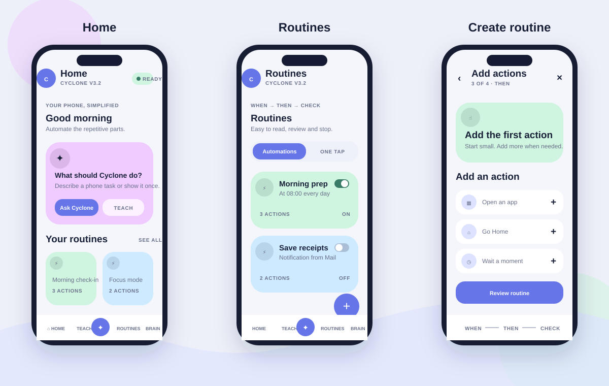

# Cyclone Mobile V3.2 experience redesign

Status: approved implementation direction for the V3.2 mobile overhaul.

This package turns the visual references supplied for the redesign into a Cyclone-specific product
system. The references are inspiration for hierarchy, softness and flow only. Cyclone remains a
phone automation and autonomy product; it does not adopt smart-home terminology, device models or
feature assumptions.

## Product promise

> Tell Cyclone what should happen. See the trigger, actions and proof. Stay in control.

Cyclone must feel simpler than the phone task it automates. The interface therefore exposes one
primary decision per screen, uses plain language, and moves technical evidence into progressive
detail instead of presenting a cockpit.

## Experience principles

1. **Simple before powerful.** The default path is one clear next action. Advanced selectors,
   recovery and evidence remain available behind review screens.
2. **When → Then → Check.** Every automation is explained as its starting condition, ordered phone
   actions, and verification. This mirrors how users naturally describe a routine.
3. **Phone-native triggers first.** One tap, notification received, time, app opened and calendar
   events are first-class. Remote/Codex triggers are extensions, not the default mental model.
4. **Pastel, not childish.** Large rounded surfaces, low-contrast page backgrounds, confident dark
   typography and one vivid accent per card. Color groups content; it never replaces labels.
5. **Calm motion.** State changes use short fades/expands. No perpetual animation, flashing status or
   decorative motion while the phone is being controlled.
6. **Evidence without anxiety.** “Checked”, “Needs attention” and “Waiting for you” are the primary
   states. Raw traces and debug language live in details.
7. **One Cyclone.** Home, Teach, AI, Automations, Brain and Settings remain recognizable product
   surfaces. PC + Codex Gateway stays inside AI. All actions continue through policy and the
   canonical `PhoneToolExecutor`.

## Navigation

The bottom navigation remains stable and thumb-friendly:

- **Home** — today, readiness, recent/featured routines and one obvious next action.
- **Teach** — Follow Me, manual routine teaching and app learning.
- **AI** — the central intent surface for a phone mission, Brain conversation and PC + Codex.
- **Routines** — automations and one-tap routines, plus the builder.
- **Brain** — understandable learned knowledge, freshness and recent outcomes.

Settings opens from the profile button. It is not a sixth bottom destination.

## Screen system

### Home

- Small product header and readiness indicator.
- One hero card: “What should Cyclone do?” with AI and Teach actions.
- Compact “Phone ready / finish setup” card; permissions are not shown as four competing panels.
- A short row of recent one-tap routines.
- Recent activity is summarized in human language.

### Routines

- Segmented switch between **Automations** and **One tap**.
- Each card shows name, `When` summary, action count, last state and one enable switch.
- Tapping a card opens the review screen; the floating `+` opens creation.
- Empty state explains the three creation paths: build here, teach, or ask AI.

### Create routine

Creation is a focused path, not a form wall:

1. **When** — choose one tap, notification, time, app opened, calendar or Cyclone/Codex.
2. **Details** — request only fields needed by that trigger.
3. **Then** — add ordered, typed phone actions.
4. **Check** — describe the verification or clearly say that verification will be added later.
5. **Name & review** — show one readable summary and save.

The first implementation supports safe, typed starter actions and saves directly into the existing
`AutomationStore`. It does not invent another executor or automation database.

### Teach

- Follow Me is the single hero action.
- Active learning shows pages, actions and current app without debug jargon.
- Manual teaching and app learning are secondary cards.
- Privacy rules are stated once, close to the start action.

### AI

- One large prompt with “Do it” and “Make a routine”.
- Phone and Brain modes use a small segmented control.
- The latest result is a calm status card with an optional detailed timeline.
- PC + Codex Gateway remains a clearly named extension inside this surface.
- Model/provider configuration moves to Settings.

### Brain

- Summary: apps, reusable skills, paths, confidence and freshness.
- Knowledge entries use human names and outcome counts.
- Technical source/provenance is available in detail but not the visual headline.

### Settings

- Grouped sections: Phone access, AI, Connections, Privacy & safety, About.
- Permission rows show one state and one action.
- Secrets remain Android-Keystore backed and visually masked.

## Visual language

The implementation source of truth is `DESIGN_TOKENS.json` and
`CycloneV32DesignSystem.kt`.

- Page background: warm ice instead of pure white.
- Ink: deep navy rather than black.
- Primary: periwinkle/indigo.
- Supporting pastels: lilac, mint, lemon, peach and sky.
- Outer cards: 26–32dp radius; controls: 16–22dp; pills: full radius.
- Minimum touch target: 48dp.
- Spacing: 4dp base, normally 8/12/16/24/32dp.
- Headlines are short and confident; helper copy targets two lines.
- Dark mode uses deep blue surfaces with softened pastel accents, not inverted neon.

## Android-native trigger map

| User label | Existing contract | Runtime readiness |
|---|---|---|
| One tap | `MANUAL` | ready |
| Notification received | `NOTIFICATION` | ready; notification access required |
| At a time | `SCHEDULE` | ready; AlarmManager |
| App opened | `APP_OPENED` | ready; Accessibility event |
| Calendar event | `CALENDAR_TIME` | contract seam only; hidden until an Android event producer is wired |
| Cyclone or Codex | `CYCLONE_REMOTE` | ready through constrained connection |

Location, charging, Bluetooth, Wi-Fi and headset triggers belong to a later contract phase. They
must not be shown as working until their Android receivers, permissions, policy and tests exist.

## Delivery phases

### Phase A — foundation and complete shell (this change)

- Install the V3.2 design system and five-tab shell.
- Redesign all six core surfaces.
- Add a native automation list, detail view and guided starter builder.
- Keep all current runtime/service initialization and safety boundaries.
- Add pure automation-draft tests and Android build verification.

### Phase B — deeper routine editing

- Reorder/edit multiple actions.
- Selector picker backed by a fresh Page Awareness observation.
- Conditions, branches, variables, waits and final verification editor.
- Run preview with permission/consequence summary.

### Phase C — richer native triggers

- Charging/battery, Wi-Fi, Bluetooth/headset and device-state contracts.
- Clear permission education and battery policy.
- Trigger simulation and next-run preview.

### Phase D — polish and accessibility

- Compose UI tests, font-scale and TalkBack audits.
- Motion specification and haptics.
- Tablet/foldable layouts and screenshot regression baselines.
- Physical Pixel acceptance and measured task-completion usability testing.

## Acceptance criteria

- A new user can identify AI, teaching and routine creation without reading documentation.
- A routine card explains when it starts and how many actions it performs.
- Creating a one-tap/open-app routine requires no technical vocabulary.
- No core surface exposes a second action engine, policy authority or memory store.
- Light/dark themes preserve contrast, touch targets and state labels.
- Existing automations load without migration.
- CI evidence is not labeled physical-device verification.
